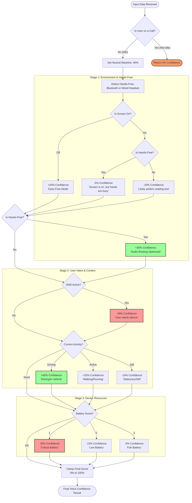

# VoiceDetector Logic Flow

This document visualizes how the `VoiceDetector` function calculates the confidence score (0-100%) for responding via voice.

## Decision Flowchart

## Quick Reference Table

| Category | Signal | Impact | Logic |
| :--- | :--- | :--- | :--- |
| **Safety** | Call State | 🛑 **Total Block** | If not "IDLE", confidence = 0%. |
| **Environment** | Hands-Free | 🚀 **+30%** | Bluetooth/Headsets are optimized for voice. |
| **Visibility** | Screen State | 👁️ **+20% / -20%** | Screen off favors voice; Screen on favors text. |
| **Hands-Free Logic**| Screen On + HF | ⚖️ **-5%** | Penalty is mitigated if user is hands-free. |
| **Silence** | DND Active | 🤫 **-40%** | Explicit request for no interruptions. |
| **Power** | Battery Score | 🔋 **Up to -30%** | Voice tasks are heavy; lower confidence saves power. |
